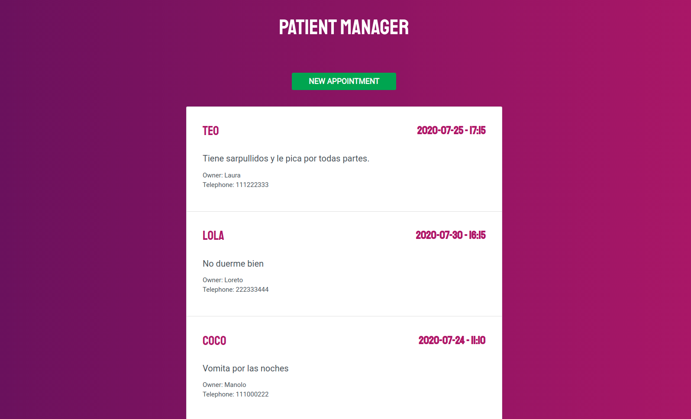
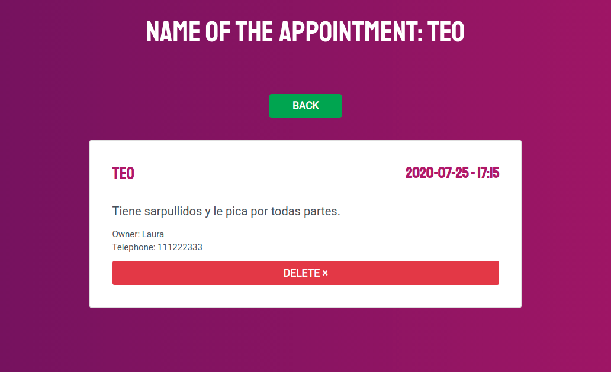
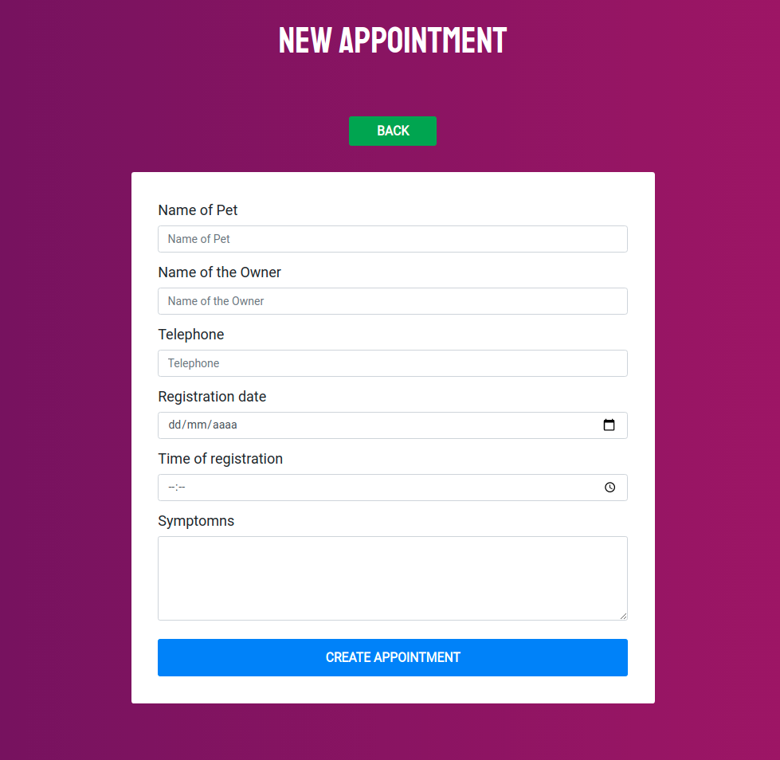

## · Build a patient manager with React and NodeJS ·

- Using React and Hooks as Frontend
- Using NodeJS, Express, MongoDB and Axios as Backend.
- Bootstrap and SweetAlert2 to design website.
- Electron to build the Desktop App.

Based on the [Udemy Course](https://www.udemy.com/course/javascript-moderno-guia-definitiva-construye-10-proyectos) given by [Juan Pablo de la Torre Valdez](https://twitter.com/JuanDevWP).

        

        

        

