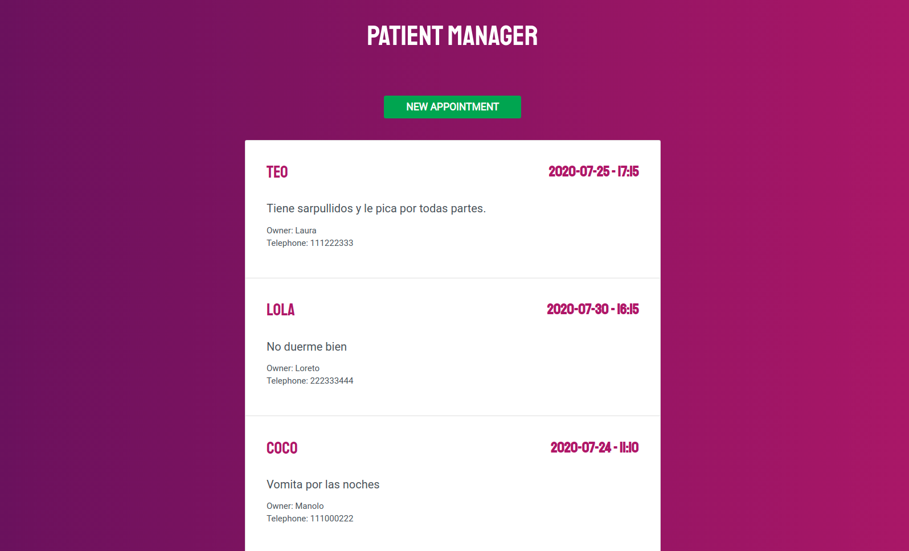
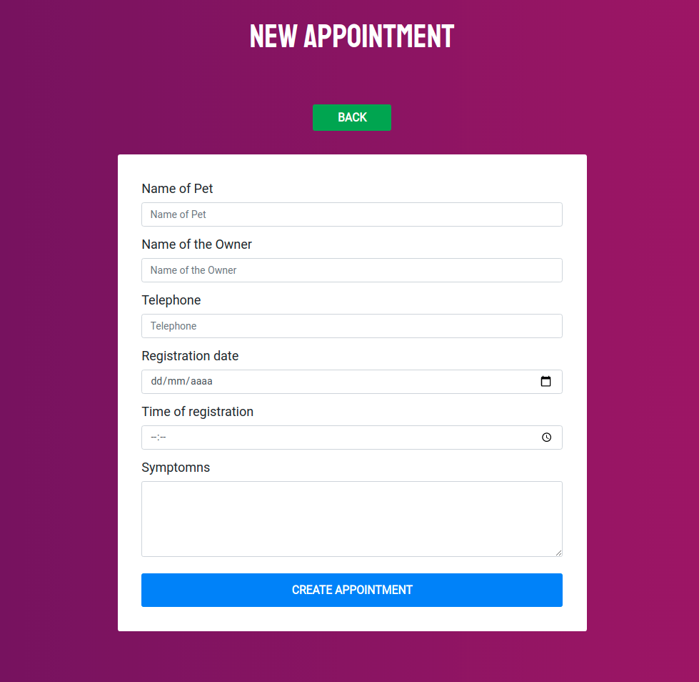

## · Build a patient manager with React. Using NodeJS, Express and MongoDB ·

Based on the [Udemy Course](https://www.udemy.com/course/javascript-moderno-guia-definitiva-construye-10-proyectos) given by [Juan Pablo de la Torre Valdez](https://twitter.com/JuanDevWP).

        

        

        

